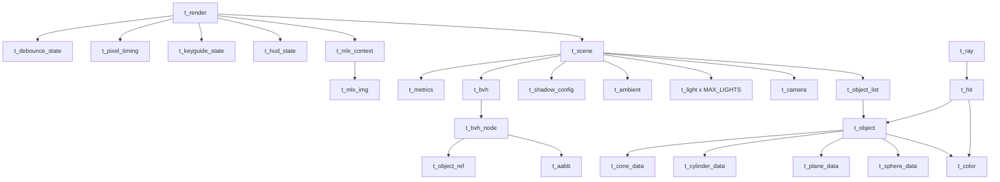

# Data Structures

miniRT의 핵심 자료구조 정의와 관계를 설명합니다.

---

## 구조체 관계도



---

## 씬 관련

### `t_scene` (includes/minirt.h)

전체 씬 상태를 담는 최상위 구조체.

```c
typedef struct s_scene
{
    t_ambient       ambient;              // 환경광
    t_camera        camera;               // 카메라
    t_light         lights[MAX_LIGHTS];   // 광원 배열 (최대 16)
    int             light_count;          // 현재 광원 수
    int             selected_light;       // 조작 대상 광원 인덱스
    t_shadow_config shadow_config;        // 그림자 설정
    t_object_list   objects;              // 오브젝트 동적 배열
    int             flags;                // 씬 상태 비트 플래그
    t_bvh           *bvh;                 // BVH 트리 포인터
    t_metrics       metrics;              // 성능 메트릭
}   t_scene;
```

플래그: `SCENE_HAS_AMBIENT (0x01)`, `SCENE_HAS_CAMERA (0x02)`, `SCENE_BVH_ENABLED (0x08)`

### `t_camera` (includes/minirt.h)

```c
typedef struct s_camera
{
    t_vec3          position;           // 현재 위치
    t_vec3          direction;          // 시선 방향 (정규화)
    t_vec3          initial_position;   // 리셋용 초기 위치
    t_vec3          initial_direction;  // 리셋용 초기 방향
    double          fov;                // 시야각 (1~179, 정수 파싱)
    double          pitch;              // Euler 피치 (라디안)
    double          yaw;                // Euler 요 (라디안)
    t_camera_cache  cache;              // basis 벡터 캐시
}   t_camera;
```

### `t_light` (includes/minirt.h)

```c
typedef struct s_light
{
    t_vec3  position;    // 광원 위치
    double  brightness;  // 밝기 (0.0~1.0)
    t_color color;       // 광원 색상
}   t_light;
```

### `t_ambient` (includes/minirt.h)

```c
typedef struct s_ambient
{
    double  ratio;  // 환경광 강도 (0.0~1.0)
    t_color color;  // 환경광 색상
}   t_ambient;
```

---

## 오브젝트 관련

### `t_object` (includes/objects.h)

통합 오브젝트 구조체. union으로 타입별 데이터를 공유합니다.

```c
typedef struct s_object
{
    t_object_type   type;           // OBJ_SPHERE, OBJ_PLANE, OBJ_CYLINDER, OBJ_CONE
    t_color         color;          // RGB 색상
    t_color         checker_color;  // 체커보드 보조 색상
    int             has_checker;    // 체커보드 활성화 여부
    char            *bump_path;     // 범프맵 XPM 파일 경로
    t_bump_map      *bump_map;      // 범프맵 데이터 (지연 로드)
    char            id[8];          // 식별자 (예: "sp-1", "cy-2")
    union u_object_data
    {
        t_sphere_data   sphere;
        t_plane_data    plane;
        t_cylinder_data cylinder;
        t_cone_data     cone;
    }   data;
}   t_object;
```

### `t_sphere_data`

```c
typedef struct s_sphere_data
{
    t_vec3  center;     // 구 중심
    double  radius;     // 반지름
    double  radius_sq;  // 반지름^2 (캐싱)
}   t_sphere_data;
```

### `t_plane_data`

```c
typedef struct s_plane_data
{
    t_vec3  point;   // 평면 위의 한 점
    t_vec3  normal;  // 법선 벡터 (정규화)
}   t_plane_data;
```

### `t_cylinder_data`

```c
typedef struct s_cylinder_data
{
    t_vec3  center;       // 원기둥 중심
    t_vec3  axis;         // 축 방향 (정규화)
    double  radius;       // 반지름
    double  radius_sq;    // 반지름^2 (캐싱)
    double  half_height;  // 높이/2
}   t_cylinder_data;
```

### `t_cone_data`

```c
typedef struct s_cone_data
{
    t_vec3  center;       // 원뿔 중심 (높이 중앙)
    t_vec3  axis;         // 축 방향 (정규화, center→apex)
    double  radius;       // 밑면 반지름
    double  radius_sq;    // 반지름^2 (캐싱)
    double  half_height;  // 높이/2
}   t_cone_data;
```

### `t_object_list` (includes/minirt.h)

```c
typedef struct s_object_list
{
    t_object    *items;     // 동적 배열
    int         count;      // 현재 개수
    int         capacity;   // 할당 용량 (초기 32)
}   t_object_list;
```

---

## 광선 관련

### `t_ray` (includes/ray.h)

```c
typedef struct s_ray
{
    t_vec3  origin;     // 광선 시작점
    t_vec3  direction;  // 방향 (정규화)
    t_vec3  inv_dir;    // 1/direction (AABB 교차용, 사전 계산)
}   t_ray;
```

### `t_hit` (includes/ray.h)

```c
typedef struct s_hit
{
    double      distance;  // 교차 거리 (t값)
    t_vec3      point;     // 교차점 좌표
    t_vec3      normal;    // 교차점 법선
    t_color     color;     // 오브젝트 색상
    t_object    *obj;      // 교차된 오브젝트 포인터 (체커보드/범프맵 접근용)
}   t_hit;
```

---

## BVH 관련

### `t_bvh` (includes/spatial.h)

```c
typedef struct s_bvh
{
    t_bvh_node      *root;         // 트리 루트
    int             enabled;       // 활성화 여부
    int             max_depth;     // 최대 깊이
    int             visualize;     // 시각화 플래그
    t_plane_refs    plane_refs;    // 분리된 plane 인덱스
}   t_bvh;
```

### `t_bvh_node` (includes/spatial.h)

```c
typedef struct s_bvh_node
{
    t_aabb              bounds;        // 바운딩 박스
    struct s_bvh_node   *left;         // 좌측 자식
    struct s_bvh_node   *right;        // 우측 자식
    t_object_ref        *objects;      // 리프 오브젝트 목록
    int                 object_count;  // 리프 오브젝트 수
    int                 depth;         // 노드 깊이
    int                 split_axis;    // 분할 축 (0=x, 1=y, 2=z)
}   t_bvh_node;
```

### `t_aabb` (includes/spatial.h)

```c
typedef struct s_aabb
{
    t_vec3  min;  // 각 축 최솟값으로 구성된 대각선 꼭짓점
    t_vec3  max;  // 각 축 최댓값으로 구성된 대각선 꼭짓점
}   t_aabb;
```

### `t_plane_refs` (includes/spatial.h)

```c
typedef struct s_plane_refs
{
    int     *indices;  // 오브젝트 리스트 내 plane 인덱스 배열
    int     count;     // plane 개수
}   t_plane_refs;
```

---

## 그림자 관련

### `t_shadow_config` (includes/shadow.h)

```c
typedef struct s_shadow_config
{
    int     samples;      // 그림자 샘플 수 (1=hard, >1=soft)
    double  softness;     // 소프트니스 (0.0~1.0)
    double  bias_scale;   // shadow bias 배수
    int     enable_ao;    // AO 활성화 (미구현)
    t_vec3  *offset_lut;  // 사전 계산된 offset LUT
}   t_shadow_config;
```

---

## 메트릭 관련

### `t_metrics` (includes/metrics.h)

```c
typedef struct s_metrics
{
    t_frame_timing  timing;        // 프레임 시간 측정
    t_ray_metrics   ray;           // 레이/교차 카운터
    t_bvh_metrics   bvh;           // BVH 노드 방문/스킵 카운터
    int             quality_mode;  // 품질 모드
}   t_metrics;
```

---

## 렌더 컨텍스트

### `t_render` (includes/window.h)

```c
typedef struct s_render
{
    t_mlx_context       mlx;            // MiniLibX 핸들
    t_scene             *scene;         // 씬 포인터
    t_selection         selection;      // 선택된 오브젝트
    int                 state_flags;    // 렌더 상태 비트 플래그
    t_hud_state         hud;            // HUD 상태
    t_keyguide_state    keyguide;       // 키가이드 상태
    t_pixel_timing      pixel_timing;   // 픽셀 타이밍
    t_debounce_state    debounce;       // 디바운스 상태
}   t_render;
```

렌더 상태 플래그:

| 플래그 | 값 | 설명 |
|--------|------|------|
| `RENDER_DIRTY` | 0x01 | 재렌더링 필요 |
| `RENDER_RENDERING` | 0x02 | 렌더링 진행 중 |
| `RENDER_LOW_QUALITY` | 0x04 | 저품질 프리뷰 모드 |
| `RENDER_BVH_DIRTY` | 0x20 | BVH 재구축 필요 |
| `RENDER_ENABLE_PIXEL_TIMING` | 0x40 | 픽셀 타이밍 측정 활성화 |
| `RENDER_ENABLE_METRICS_PRINT` | 0x80 | 콘솔 메트릭 출력 활성화 |

---

## 기본 타입

### `t_vec3` (includes/vec3.h)

```c
typedef struct s_vec3
{
    double  x;
    double  y;
    double  z;
}   t_vec3;
```

### `t_color` (includes/objects.h)

```c
typedef struct s_color
{
    int  r;  // 0~255
    int  g;
    int  b;
}   t_color;
```
