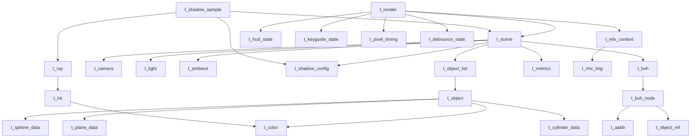

# miniRT Struct Map (Role + Relationships)

아래는 **현재 코드에 존재하는 모든 구조체**를 파일별로 정리한 목록과,
관계 다이어그램입니다.

---

## `includes/vec3.h`
- `t_vec3`
  - 역할: 3D 벡터/점 (x,y,z)
  - 관계: 대부분의 기하/광학 구조체에서 기본 타입으로 사용

---

## `includes/objects.h`
- `t_color`
  - 역할: RGB 컬러 (0~255 정수)
  - 관계: `t_object`, `t_hit`, `t_light`, `t_ambient` 등에서 사용

- `t_sphere_data`
  - 역할: 구 기본 데이터(중심, 반지름, 제곱)
  - 관계: `t_object`의 union 멤버

- `t_plane_data`
  - 역할: 평면 데이터(점, 법선)
  - 관계: `t_object`의 union 멤버

- `t_cylinder_data`
  - 역할: 원기둥 데이터(중심, 축, 반지름, 높이/half)
  - 관계: `t_object`의 union 멤버

- `t_object`
  - 역할: 통합 오브젝트 구조체 (type + color + id + union)
  - 관계: `t_object_list`가 배열로 보유, `t_hit`에 색 포함

- `t_sphere`, `t_plane`, `t_cylinder` (legacy)
  - 역할: 구/평면/원기둥 개별 레거시 구조체
  - 관계: 파서/레거시 코드 호환용

---

## `includes/ray.h`
- `t_ray`
  - 역할: 레이 (origin + direction)
  - 관계: 교차/조명/렌더 경로 전반에 사용

- `t_hit` (`t_hit_record` alias)
  - 역할: 교차 결과 (hit 여부, 거리, 위치, 법선, 색)
  - 관계: BVH/교차/조명 모두에서 사용

- `t_cyl_calc`
  - 역할: 원기둥 교차 계산 중간 값
  - 관계: 원기둥 인터섹션 함수 내부 전용

- `t_intersect_params`
  - 역할: 범용 교차 검사 호출용 파라미터 묶음
  - 관계: function pointer 기반 교차 루틴에 사용

---

## `includes/spatial.h`
- `t_aabb`
  - 역할: AABB(축정렬 바운딩 박스)
  - 관계: `t_bvh_node`의 bounds

- `t_object_ref`
  - 역할: 오브젝트 리스트 내 인덱스 참조
  - 관계: BVH 노드가 보유하는 리프 객체 목록

- `t_bvh_node`
  - 역할: BVH 노드
  - 관계: 좌/우 자식, `t_aabb`, `t_object_ref` 배열 보유

- `t_bvh`
  - 역할: BVH 루트 + 상태 플래그
  - 관계: `t_scene`가 포인터로 보유

- `t_hit_check`
  - 역할: BVH traversal 시 좌/우 hit 비교용 컨텍스트
  - 관계: `t_hit_record` 포인터 참조

- `t_axis_check`
  - 역할: AABB 축 교차 계산 파라미터 묶음
  - 관계: AABB 교차 헬퍼용

- `t_partition_params`
  - 역할: BVH 분할 파라미터
  - 관계: build 단계에서 사용

- `t_split_params`
  - 역할: BVH split 노드 생성 파라미터
  - 관계: build 단계에서 사용

---

## `includes/minirt.h`
- `t_cam_calc`
  - 역할: 카메라 레이 계산 보조(우/상 방향 등)
  - 관계: `t_camera` 기반 계산

- `t_color_f`
  - 역할: 부동소수 컬러 계산용
  - 관계: 조명 계산 중 사용

- `t_ambient`
  - 역할: 환경광 정보
  - 관계: `t_scene`에 포함

- `t_camera`
  - 역할: 카메라 정보(위치, 방향, FOV)
  - 관계: `t_scene`에 포함

- `t_light`
  - 역할: 점광원
  - 관계: `t_scene`에 포함

- `t_object_list`
  - 역할: 오브젝트 동적 배열
  - 관계: `t_scene`에 포함, 내부에 `t_object *items`

- `t_scene`
  - 역할: 전체 씬 상태(조명, 카메라, 오브젝트, BVH, 메트릭)
  - 관계: `t_bvh`, `t_metrics`, `t_shadow_config` 등 포함

---

## `includes/shadow.h`
- `t_shadow_config`
  - 역할: 그림자 품질/샘플/바이어스 설정
  - 관계: `t_scene`에 포함

- `t_shadow_sample`
  - 역할: 그림자 샘플링용 파라미터 묶음
  - 관계: `t_scene`, `t_shadow_config`, 위치/바이어스 포함

---

## `includes/metrics.h`
- `t_bvh_metrics`
  - 역할: BVH traversal 관련 카운터
  - 관계: `t_metrics`에 포함

- `t_ray_metrics`
  - 역할: 레이/인터섹션 카운터
  - 관계: `t_metrics`에 포함

- `t_frame_timing`
  - 역할: 프레임 시간 측정/히스토리
  - 관계: `t_metrics`에 포함

- `t_metrics`
  - 역할: 렌더링 성능 메트릭 묶음
  - 관계: `t_scene`에 포함

---

## `includes/parser.h`
- `t_line_reader`
  - 역할: 버퍼 기반 라인 리더 상태
  - 관계: 파서 루프에서 사용

- `t_error_context`
  - 역할: 파싱 에러 컨텍스트
  - 관계: 파서 함수들의 에러 보고에 사용

---

## `includes/render_state.h`
- `t_interaction_state`
  - 역할: 사용자 상호작용 상태 추적
  - 관계: `t_render_state`에 포함

- `t_progressive_state`
  - 역할: 프로그레시브 렌더 상태
  - 관계: `t_render_state`에 포함

- `t_tile_rect`
  - 역할: 프로그레시브 타일 좌표
  - 관계: 타일 렌더 루프에서 사용

- `t_render_state`
  - 역할: 품질/상호작용/프로그레시브 상태 묶음
  - 관계: 렌더링 루프에서 사용

---

## `includes/render_debounce.h`
- `t_debounce_timer`
  - 역할: 입력 디바운스용 타이머
  - 관계: `t_debounce_state`에 포함

- `t_debounce_state`
  - 역할: 디바운스 상태 머신
  - 관계: `t_render`와 연동

---

## `includes/pixel_timing.h`
- `t_pixel_timing`
  - 역할: 픽셀 단위 시간 샘플링/통계
  - 관계: `t_render`에 포함

---

## `includes/mlx_context.h`
- `t_mlx_img`
  - 역할: MLX 이미지 데이터(버퍼, 포맷 정보)
  - 관계: `t_mlx_context`, HUD/오버레이 등에서 사용

- `t_mlx_context`
  - 역할: MLX 핸들/윈도우/이미지 묶음
  - 관계: `t_render`에 포함

---

## `includes/window.h`
- `t_selection`
  - 역할: HUD에서 선택된 오브젝트 정보
  - 관계: `t_render`에 포함

- `t_hud_state`
  - 역할: HUD 상태(페이지/표시/버퍼)
  - 관계: `t_render`에 포함

- `t_keyguide_state`
  - 역할: 키 가이드 오버레이 상태
  - 관계: `t_render`에 포함

- `t_render`
  - 역할: 렌더링 컨텍스트(MLX + scene + UI 상태)
  - 관계: `t_scene`, `t_mlx_context`, `t_pixel_timing`, `t_debounce_state` 포함

---

## `includes/overlay.h`
- `t_hud_data`
  - 역할: HUD 데이터(이미지 외)
  - 관계: `t_hud_overlay`에 포함

- `t_keyguide_data`
  - 역할: 키 가이드 데이터(이미지 외)
  - 관계: `t_keyguide_overlay`에 포함

- `t_hud_overlay`
  - 역할: HUD 이미지 + 데이터 묶음
  - 관계: `t_mlx_img` 포함

- `t_keyguide_overlay`
  - 역할: 키 가이드 이미지 + 데이터 묶음
  - 관계: `t_mlx_img` 포함

---

## `includes/hud.h`
- `t_pixel_params`
  - 역할: HUD 픽셀 조작 파라미터 묶음
  - 관계: HUD 내부 렌더 헬퍼에서 사용

- `t_perf_text`
  - 역할: 성능 텍스트 출력 파라미터 묶음
  - 관계: HUD 내부 출력에서 사용

---

## `includes/bvh_vis.h`
- `t_vis_config`
  - 역할: BVH 시각화 설정
  - 관계: BVH visualize 도구에서 사용

- `t_prefix_state`
  - 역할: 트리 출력 prefix 상태
  - 관계: BVH 시각화 출력 루틴에서 사용

- `t_bvh_stats`
  - 역할: BVH 통계 정보
  - 관계: BVH 시각화/리포트에서 사용

- `t_node_info`
  - 역할: BVH 노드 출력 정보
  - 관계: 출력 포맷팅에서 사용

- `t_traverse_ctx`
  - 역할: BVH 시각화 traversal 컨텍스트
  - 관계: `t_prefix_state`, `t_vis_config` 포함

---

# Relationship Diagram (Simplified)

